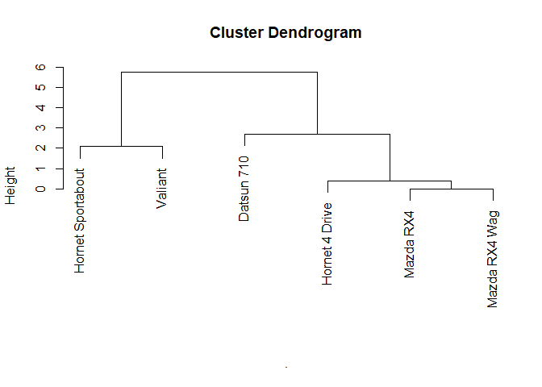

<!-- README.md is generated from README.Rmd. Please edit that file -->

# clust431

<!-- badges: start -->

<!-- badges: end -->

The goal of clust431 is to preform hierarchical clustering and k-means
clustering.

## Installation

You can install the released version of clust431 from
[CRAN](https://CRAN.R-project.org) with:

``` r
install.packages("clust431")
```

## Example K-Means

K-Means clustering example on a dataset of two variables using k\_means

``` r
mydata <- select(iris, Petal.Length, Petal.Width)


k_means(mydata, 3, PCA = F)
#> $`Clustering vector`
#>   [1] 2 2 2 2 2 2 2 2 2 2 2 2 2 2 2 2 2 2 2 2 2 2 2 2 2 2 2 2 2 2 2 2 2 2 2 2 2
#>  [38] 2 2 2 2 2 2 2 2 2 2 2 2 2 3 3 3 3 3 3 3 3 3 3 3 3 3 3 3 3 3 3 3 3 3 3 3 3
#>  [75] 3 3 3 1 3 3 3 3 3 1 3 3 3 3 3 3 3 3 3 3 3 3 3 3 3 3 1 1 1 1 1 1 3 1 1 1 1
#> [112] 1 1 1 1 1 1 1 1 3 1 1 1 1 1 1 3 1 1 1 1 1 1 1 1 1 1 1 3 1 1 1 1 1 1 1 1 1
#> [149] 1 1
#> 
#> $`Cluster Means`
#>       [,1]     [,2]
#> 1 5.595833 2.037500
#> 2 1.462000 0.246000
#> 3 4.269231 1.342308
#> 
#> $`Total SSE`
#> [1] 31.37136
```

Comparison with kmeans function in the stats package

``` r
kmeans(mydata, 3)
#> K-means clustering with 3 clusters of sizes 52, 48, 50
#> 
#> Cluster means:
#>   Petal.Length Petal.Width
#> 1     4.269231    1.342308
#> 2     5.595833    2.037500
#> 3     1.462000    0.246000
#> 
#> Clustering vector:
#>   [1] 3 3 3 3 3 3 3 3 3 3 3 3 3 3 3 3 3 3 3 3 3 3 3 3 3 3 3 3 3 3 3 3 3 3 3 3 3
#>  [38] 3 3 3 3 3 3 3 3 3 3 3 3 3 1 1 1 1 1 1 1 1 1 1 1 1 1 1 1 1 1 1 1 1 1 1 1 1
#>  [75] 1 1 1 2 1 1 1 1 1 2 1 1 1 1 1 1 1 1 1 1 1 1 1 1 1 1 2 2 2 2 2 2 1 2 2 2 2
#> [112] 2 2 2 2 2 2 2 2 1 2 2 2 2 2 2 1 2 2 2 2 2 2 2 2 2 2 2 1 2 2 2 2 2 2 2 2 2
#> [149] 2 2
#> 
#> Within cluster sum of squares by cluster:
#> [1] 13.05769 16.29167  2.02200
#>  (between_SS / total_SS =  94.3 %)
#> 
#> Available components:
#> 
#> [1] "cluster"      "centers"      "totss"        "withinss"     "tot.withinss"
#> [6] "betweenss"    "size"         "iter"         "ifault"
```

Example of k\_means using PCA

``` r
k_means(mtcars, 3, PCA = T)
#> $`Clustering vector`
#>  [1] 1 1 1 3 3 1 3 1 1 1 1 3 3 3 2 2 2 1 1 1 1 3 3 3 2 1 1 1 3 1 3 1
#> 
#> $`Cluster Means`
#>         [,1]        [,2]
#> 1  113.74034  -0.1440045
#> 2 -217.14381  38.7835918
#> 3  -96.81913 -13.8805719
#> 
#> $`Total SSE`
#> [1] 103210.8
```

Example of k\_means using PCA and the k-means++ algorithm for improved
initialization

``` r
k_means(mtcars, 3, PCA = T, plus.plus = T)
#> $`Clustering vector`
#>  [1] 1 1 1 1 2 1 2 1 1 1 1 2 2 2 2 2 2 1 1 1 1 2 2 2 2 1 1 1 2 1 3 1
#> 
#> $`Cluster Means`
#>        [,1]        [,2]
#> 1  106.9483    2.363197
#> 2 -136.9006    7.423969
#> 3 -145.3617 -139.049149
#> 
#> $`Total SSE`
#> [1] 132185.5
```

## Example Hierarchical Clustering

Hierarchical clustering on a dataset

``` r
mydata <- select(mtcars, mpg, cyl) %>% head(6)

hier_clust(mydata)
#> [1] "Mazda RX4 Wag,Mazda RX4"                                                    
#> [2] "Hornet 4 Drive,Mazda RX4 Wag,Mazda RX4"                                     
#> [3] "Valiant,Hornet Sportabout"                                                  
#> [4] "Datsun 710,Hornet 4 Drive,Mazda RX4 Wag,Mazda RX4"                          
#> [5] "Valiant,Hornet Sportabout,Hornet 4 Drive,Mazda RX4 Wag,Mazda RX4,Datsun 710"
```

Comparison using the hclust function in the stats package

``` r
mydata %>% dist() %>% hclust() %>% plot(sub = "")
```



Example of hierachical clustering using the manhattan distance metric

``` r
hier_clust(mydata, method = 'manhattan')
#> [1] "Mazda RX4 Wag,Mazda RX4"                                                    
#> [2] "Mazda RX4 Wag,Mazda RX4,Hornet 4 Drive"                                     
#> [3] "Valiant,Hornet Sportabout"                                                  
#> [4] "Mazda RX4 Wag,Mazda RX4,Hornet 4 Drive,Datsun 710"                          
#> [5] "Valiant,Hornet Sportabout,Mazda RX4 Wag,Mazda RX4,Hornet 4 Drive,Datsun 710"
```

Example of hierachical clustering using a large dataset

``` r
hier_clust(mtcars)
#>  [1] "Mazda RX4 Wag,Mazda RX4"                                                                                                                                                                                                                                                                                                                                                                                                     
#>  [2] "Merc 450SL,Merc 450SE"                                                                                                                                                                                                                                                                                                                                                                                                       
#>  [3] "Merc 280C,Merc 280"                                                                                                                                                                                                                                                                                                                                                                                                          
#>  [4] "Merc 450SL,Merc 450SE,Merc 450SLC"                                                                                                                                                                                                                                                                                                                                                                                           
#>  [5] "Fiat 128,Fiat X1-9"                                                                                                                                                                                                                                                                                                                                                                                                          
#>  [6] "Porsche 914-2,Toyota Corona"                                                                                                                                                                                                                                                                                                                                                                                                 
#>  [7] "Duster 360,Camaro Z28"                                                                                                                                                                                                                                                                                                                                                                                                       
#>  [8] "Fiat 128,Fiat X1-9,Toyota Corolla"                                                                                                                                                                                                                                                                                                                                                                                           
#>  [9] "Datsun 710,Porsche 914-2,Toyota Corona"                                                                                                                                                                                                                                                                                                                                                                                      
#> [10] "AMC Javelin,Dodge Challenger"                                                                                                                                                                                                                                                                                                                                                                                                
#> [11] "Fiat 128,Fiat X1-9,Toyota Corolla,Honda Civic"                                                                                                                                                                                                                                                                                                                                                                               
#> [12] "Cadillac Fleetwood,Lincoln Continental"                                                                                                                                                                                                                                                                                                                                                                                      
#> [13] "Merc 280C,Merc 280,Mazda RX4 Wag,Mazda RX4"                                                                                                                                                                                                                                                                                                                                                                                  
#> [14] "Volvo 142E,Datsun 710,Porsche 914-2,Toyota Corona"                                                                                                                                                                                                                                                                                                                                                                           
#> [15] "Ford Pantera L,Duster 360,Camaro Z28"                                                                                                                                                                                                                                                                                                                                                                                        
#> [16] "Volvo 142E,Datsun 710,Porsche 914-2,Toyota Corona,Merc 230"                                                                                                                                                                                                                                                                                                                                                                  
#> [17] "Valiant,Hornet 4 Drive"                                                                                                                                                                                                                                                                                                                                                                                                      
#> [18] "Hornet Sportabout,Pontiac Firebird"                                                                                                                                                                                                                                                                                                                                                                                          
#> [19] "Cadillac Fleetwood,Lincoln Continental,Chrysler Imperial"                                                                                                                                                                                                                                                                                                                                                                    
#> [20] "Lotus Europa,Volvo 142E,Datsun 710,Porsche 914-2,Toyota Corona,Merc 230"                                                                                                                                                                                                                                                                                                                                                     
#> [21] "AMC Javelin,Dodge Challenger,Merc 450SL,Merc 450SE,Merc 450SLC"                                                                                                                                                                                                                                                                                                                                                              
#> [22] "Merc 280C,Merc 280,Mazda RX4 Wag,Mazda RX4,Merc 240D"                                                                                                                                                                                                                                                                                                                                                                        
#> [23] "Lotus Europa,Volvo 142E,Datsun 710,Porsche 914-2,Toyota Corona,Merc 230,Merc 280C,Merc 280,Mazda RX4 Wag,Mazda RX4,Merc 240D"                                                                                                                                                                                                                                                                                                
#> [24] "Ford Pantera L,Duster 360,Camaro Z28,Hornet Sportabout,Pontiac Firebird"                                                                                                                                                                                                                                                                                                                                                     
#> [25] "AMC Javelin,Dodge Challenger,Merc 450SL,Merc 450SE,Merc 450SLC,Valiant,Hornet 4 Drive"                                                                                                                                                                                                                                                                                                                                       
#> [26] "Lotus Europa,Volvo 142E,Datsun 710,Porsche 914-2,Toyota Corona,Merc 230,Merc 280C,Merc 280,Mazda RX4 Wag,Mazda RX4,Merc 240D,Ferrari Dino"                                                                                                                                                                                                                                                                                   
#> [27] "Cadillac Fleetwood,Lincoln Continental,Chrysler Imperial,Ford Pantera L,Duster 360,Camaro Z28,Hornet Sportabout,Pontiac Firebird"                                                                                                                                                                                                                                                                                            
#> [28] "Fiat 128,Fiat X1-9,Toyota Corolla,Honda Civic,Lotus Europa,Volvo 142E,Datsun 710,Porsche 914-2,Toyota Corona,Merc 230,Merc 280C,Merc 280,Mazda RX4 Wag,Mazda RX4,Merc 240D,Ferrari Dino"                                                                                                                                                                                                                                     
#> [29] "Cadillac Fleetwood,Lincoln Continental,Chrysler Imperial,Ford Pantera L,Duster 360,Camaro Z28,Hornet Sportabout,Pontiac Firebird,Maserati Bora"                                                                                                                                                                                                                                                                              
#> [30] "Fiat 128,Fiat X1-9,Toyota Corolla,Honda Civic,Lotus Europa,Volvo 142E,Datsun 710,Porsche 914-2,Toyota Corona,Merc 230,Merc 280C,Merc 280,Mazda RX4 Wag,Mazda RX4,Merc 240D,Ferrari Dino,AMC Javelin,Dodge Challenger,Merc 450SL,Merc 450SE,Merc 450SLC,Valiant,Hornet 4 Drive"                                                                                                                                               
#> [31] "Cadillac Fleetwood,Lincoln Continental,Chrysler Imperial,Ford Pantera L,Duster 360,Camaro Z28,Hornet Sportabout,Pontiac Firebird,Maserati Bora,Fiat 128,Fiat X1-9,Toyota Corolla,Honda Civic,Lotus Europa,Volvo 142E,Datsun 710,Porsche 914-2,Toyota Corona,Merc 230,Merc 280C,Merc 280,Mazda RX4 Wag,Mazda RX4,Merc 240D,Ferrari Dino,AMC Javelin,Dodge Challenger,Merc 450SL,Merc 450SE,Merc 450SLC,Valiant,Hornet 4 Drive"
```
