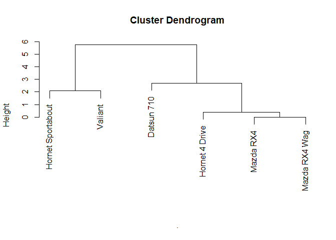

<!-- README.md is generated from README.Rmd. Please edit that file -->

# clust431

<!-- badges: start -->

<!-- badges: end -->

The goal of clust431 is to preform hierarchical clustering and k-means
clustering.

## Installation

You can install the released version of clust431 from
[CRAN](https://CRAN.R-project.org) with:

``` r
install.packages("clust431")
```

## Example K-Means

K-Means clustering example on a dataset of two variables using k\_means

``` r
mydata <- select(iris, Petal.Length, Petal.Width)


k_means(mydata, 3, PCA = F)
#> $`Clustering vector`
#>   [1] 2 2 2 2 2 2 2 2 2 2 2 2 2 2 2 2 2 2 2 2 2 2 2 2 2 2 2 2 2 2 2 2 2 2 2 2 2
#>  [38] 2 2 2 2 2 2 2 2 2 2 2 2 2 1 1 1 1 1 1 1 1 1 1 1 1 1 1 1 1 1 1 1 1 1 1 1 1
#>  [75] 1 1 1 3 1 1 1 1 1 3 1 1 1 1 1 1 1 1 1 1 1 1 1 1 1 1 3 3 3 3 3 3 1 3 3 3 3
#> [112] 3 3 3 3 3 3 3 3 1 3 3 3 1 3 3 1 1 3 3 3 3 3 3 3 3 3 3 1 3 3 3 3 3 3 3 3 3
#> [149] 3 3
#> 
#> $`Cluster Means`
#>   Petal.Length Petal.Width
#> 1     4.292593    1.359259
#> 2     1.462000    0.246000
#> 3     5.626087    2.047826
#> 
#> $`Total SSE`
#> [1] 31.41289
```

Comparison with kmeans function in the stats package

``` r
km1 <- kmeans(mydata, 3)

km1
#> K-means clustering with 3 clusters of sizes 48, 52, 50
#> 
#> Cluster means:
#>   Petal.Length Petal.Width
#> 1     5.595833    2.037500
#> 2     4.269231    1.342308
#> 3     1.462000    0.246000
#> 
#> Clustering vector:
#>   [1] 3 3 3 3 3 3 3 3 3 3 3 3 3 3 3 3 3 3 3 3 3 3 3 3 3 3 3 3 3 3 3 3 3 3 3 3 3
#>  [38] 3 3 3 3 3 3 3 3 3 3 3 3 3 2 2 2 2 2 2 2 2 2 2 2 2 2 2 2 2 2 2 2 2 2 2 2 2
#>  [75] 2 2 2 1 2 2 2 2 2 1 2 2 2 2 2 2 2 2 2 2 2 2 2 2 2 2 1 1 1 1 1 1 2 1 1 1 1
#> [112] 1 1 1 1 1 1 1 1 2 1 1 1 1 1 1 2 1 1 1 1 1 1 1 1 1 1 1 2 1 1 1 1 1 1 1 1 1
#> [149] 1 1
#> 
#> Within cluster sum of squares by cluster:
#> [1] 16.29167 13.05769  2.02200
#>  (between_SS / total_SS =  94.3 %)
#> 
#> Available components:
#> 
#> [1] "cluster"      "centers"      "totss"        "withinss"     "tot.withinss"
#> [6] "betweenss"    "size"         "iter"         "ifault"
km1$tot.withinss
#> [1] 31.37136
```

K-Means clustering with high dimensions

``` r
k_means(mtcars, 3, PCA = F)
#> $`Clustering vector`
#>           Mazda RX4       Mazda RX4 Wag          Datsun 710      Hornet 4 Drive 
#>                   2                   2                   2                   3 
#>   Hornet Sportabout             Valiant          Duster 360           Merc 240D 
#>                   1                   3                   1                   2 
#>            Merc 230            Merc 280           Merc 280C          Merc 450SE 
#>                   2                   2                   2                   3 
#>          Merc 450SL         Merc 450SLC  Cadillac Fleetwood Lincoln Continental 
#>                   3                   3                   1                   1 
#>   Chrysler Imperial            Fiat 128         Honda Civic      Toyota Corolla 
#>                   1                   2                   2                   2 
#>       Toyota Corona    Dodge Challenger         AMC Javelin          Camaro Z28 
#>                   2                   3                   3                   1 
#>    Pontiac Firebird           Fiat X1-9       Porsche 914-2        Lotus Europa 
#>                   1                   2                   2                   2 
#>      Ford Pantera L        Ferrari Dino       Maserati Bora          Volvo 142E 
#>                   1                   2                   1                   2 
#> 
#> $`Cluster Means`
#>        mpg      cyl     disp       hp     drat       wt     qsec        vs
#> 1 14.64444 8.000000 388.2222 232.1111 3.343333 4.161556 16.40444 0.0000000
#> 2 24.50000 4.625000 122.2938  96.8750 4.002500 2.518000 18.54312 0.7500000
#> 3 17.01429 7.428571 276.0571 150.7143 2.994286 3.601429 18.11857 0.2857143
#>          am     gear     carb
#> 1 0.2222222 3.444444 4.000000
#> 2 0.6875000 4.125000 2.437500
#> 3 0.0000000 3.000000 2.142857
#> 
#> $`Total SSE`
#> [1] 91343.41
```

Comparison with kmeans function in the stat package

``` r
km2 <- kmeans(mtcars, 3)

km2
#> K-means clustering with 3 clusters of sizes 7, 16, 9
#> 
#> Cluster means:
#>        mpg      cyl     disp       hp     drat       wt     qsec        vs
#> 1 17.01429 7.428571 276.0571 150.7143 2.994286 3.601429 18.11857 0.2857143
#> 2 24.50000 4.625000 122.2937  96.8750 4.002500 2.518000 18.54312 0.7500000
#> 3 14.64444 8.000000 388.2222 232.1111 3.343333 4.161556 16.40444 0.0000000
#>          am     gear     carb
#> 1 0.0000000 3.000000 2.142857
#> 2 0.6875000 4.125000 2.437500
#> 3 0.2222222 3.444444 4.000000
#> 
#> Clustering vector:
#>           Mazda RX4       Mazda RX4 Wag          Datsun 710      Hornet 4 Drive 
#>                   2                   2                   2                   1 
#>   Hornet Sportabout             Valiant          Duster 360           Merc 240D 
#>                   3                   1                   3                   2 
#>            Merc 230            Merc 280           Merc 280C          Merc 450SE 
#>                   2                   2                   2                   1 
#>          Merc 450SL         Merc 450SLC  Cadillac Fleetwood Lincoln Continental 
#>                   1                   1                   3                   3 
#>   Chrysler Imperial            Fiat 128         Honda Civic      Toyota Corolla 
#>                   3                   2                   2                   2 
#>       Toyota Corona    Dodge Challenger         AMC Javelin          Camaro Z28 
#>                   2                   1                   1                   3 
#>    Pontiac Firebird           Fiat X1-9       Porsche 914-2        Lotus Europa 
#>                   3                   2                   2                   2 
#>      Ford Pantera L        Ferrari Dino       Maserati Bora          Volvo 142E 
#>                   3                   2                   3                   2 
#> 
#> Within cluster sum of squares by cluster:
#> [1] 11846.09 32838.00 46659.32
#>  (between_SS / total_SS =  85.3 %)
#> 
#> Available components:
#> 
#> [1] "cluster"      "centers"      "totss"        "withinss"     "tot.withinss"
#> [6] "betweenss"    "size"         "iter"         "ifault"
km2$tot.withinss
#> [1] 91343.41
```

Example of k\_means using PCA

``` r
k_means(mtcars, 7, PCA = T)
#> $`Clustering vector`
#>  [1] 2 2 6 1 4 1 3 6 2 2 2 5 5 5 3 3 3 6 6 6 6 1 1 3 4 6 6 6 3 2 7 2
#> 
#> $`Cluster Means`
#> # A tibble: 7 x 2
#>   Comp.1  Comp.2
#>    <dbl>   <dbl>
#> 1  -33.3   36.0 
#> 2   82.4  -11.1 
#> 3 -195.    -2.55
#> 4 -147.    39.5 
#> 5  -55.2  -10.4 
#> 6  148.     4.43
#> 7 -145.  -139.  
#> 
#> $`Total SSE`
#> [1] 41774.24
```

Example of k\_means using PCA and the k-means++ algorithm for improved
initialization

``` r
k_means(mtcars, 7, PCA = T, plus.plus = T)
#> $`Clustering vector`
#>  [1] 3 3 2 7 4 7 4 2 2 3 3 6 6 6 1 1 1 2 2 2 2 6 6 4 4 2 2 2 5 3 5 2
#> 
#> $`Cluster Means`
#> # A tibble: 7 x 2
#>    Comp.1 Comp.2
#>     <dbl>  <dbl>
#> 1 -235.    35.6 
#> 2  141.     3.05
#> 3   71.6  -14.2 
#> 4 -151.     2.54
#> 5 -152.   -96.2 
#> 6  -62.7    6.55
#> 7    7.35  40.0 
#> 
#> $`Total SSE`
#> [1] 29147.72
```

## Example Hierarchical Clustering

Hierarchical clustering on a dataset

``` r
mydata <- select(mtcars, mpg, cyl) %>% head(6)

hier_clust(mydata)
#> [1] "Mazda RX4,Mazda RX4 Wag"                                                    
#> [2] "Mazda RX4,Mazda RX4 Wag,Hornet 4 Drive"                                     
#> [3] "Valiant,Hornet Sportabout"                                                  
#> [4] "Mazda RX4,Mazda RX4 Wag,Hornet 4 Drive,Datsun 710"                          
#> [5] "Valiant,Hornet Sportabout,Mazda RX4,Mazda RX4 Wag,Hornet 4 Drive,Datsun 710"
```

Comparison using the hclust function in the stats package

``` r
mydata %>% dist() %>% hclust() %>% plot(sub = "")
```



Example of hierachical clustering using the manhattan distance metric

``` r
hier_clust(mydata, method = 'manhattan')
#> [1] "Mazda RX4,Mazda RX4 Wag"                                                    
#> [2] "Mazda RX4,Mazda RX4 Wag,Hornet 4 Drive"                                     
#> [3] "Valiant,Hornet Sportabout"                                                  
#> [4] "Datsun 710,Mazda RX4,Mazda RX4 Wag,Hornet 4 Drive"                          
#> [5] "Valiant,Hornet Sportabout,Mazda RX4,Mazda RX4 Wag,Hornet 4 Drive,Datsun 710"
```

Example of hierachical clustering using a large dataset

``` r
hier_clust(mtcars)
#>  [1] "Mazda RX4 Wag,Mazda RX4"                                                                                                                                                                                                                                                                                                                                                                                                     
#>  [2] "Merc 450SE,Merc 450SL"                                                                                                                                                                                                                                                                                                                                                                                                       
#>  [3] "Merc 280C,Merc 280"                                                                                                                                                                                                                                                                                                                                                                                                          
#>  [4] "Merc 450SLC,Merc 450SE,Merc 450SL"                                                                                                                                                                                                                                                                                                                                                                                           
#>  [5] "Fiat X1-9,Fiat 128"                                                                                                                                                                                                                                                                                                                                                                                                          
#>  [6] "Toyota Corona,Porsche 914-2"                                                                                                                                                                                                                                                                                                                                                                                                 
#>  [7] "Duster 360,Camaro Z28"                                                                                                                                                                                                                                                                                                                                                                                                       
#>  [8] "Toyota Corolla,Fiat X1-9,Fiat 128"                                                                                                                                                                                                                                                                                                                                                                                           
#>  [9] "Toyota Corona,Porsche 914-2,Datsun 710"                                                                                                                                                                                                                                                                                                                                                                                      
#> [10] "AMC Javelin,Dodge Challenger"                                                                                                                                                                                                                                                                                                                                                                                                
#> [11] "Honda Civic,Toyota Corolla,Fiat X1-9,Fiat 128"                                                                                                                                                                                                                                                                                                                                                                               
#> [12] "Cadillac Fleetwood,Lincoln Continental"                                                                                                                                                                                                                                                                                                                                                                                      
#> [13] "Mazda RX4 Wag,Mazda RX4,Merc 280C,Merc 280"                                                                                                                                                                                                                                                                                                                                                                                  
#> [14] "Toyota Corona,Porsche 914-2,Datsun 710,Volvo 142E"                                                                                                                                                                                                                                                                                                                                                                           
#> [15] "Ford Pantera L,Duster 360,Camaro Z28"                                                                                                                                                                                                                                                                                                                                                                                        
#> [16] "Toyota Corona,Porsche 914-2,Datsun 710,Volvo 142E,Merc 230"                                                                                                                                                                                                                                                                                                                                                                  
#> [17] "Valiant,Hornet 4 Drive"                                                                                                                                                                                                                                                                                                                                                                                                      
#> [18] "Hornet Sportabout,Pontiac Firebird"                                                                                                                                                                                                                                                                                                                                                                                          
#> [19] "Chrysler Imperial,Cadillac Fleetwood,Lincoln Continental"                                                                                                                                                                                                                                                                                                                                                                    
#> [20] "Lotus Europa,Toyota Corona,Porsche 914-2,Datsun 710,Volvo 142E,Merc 230"                                                                                                                                                                                                                                                                                                                                                     
#> [21] "AMC Javelin,Dodge Challenger,Merc 450SLC,Merc 450SE,Merc 450SL"                                                                                                                                                                                                                                                                                                                                                              
#> [22] "Merc 240D,Mazda RX4 Wag,Mazda RX4,Merc 280C,Merc 280"                                                                                                                                                                                                                                                                                                                                                                        
#> [23] "Lotus Europa,Toyota Corona,Porsche 914-2,Datsun 710,Volvo 142E,Merc 230,Merc 240D,Mazda RX4 Wag,Mazda RX4,Merc 280C,Merc 280"                                                                                                                                                                                                                                                                                                
#> [24] "Ford Pantera L,Duster 360,Camaro Z28,Hornet Sportabout,Pontiac Firebird"                                                                                                                                                                                                                                                                                                                                                     
#> [25] "Valiant,Hornet 4 Drive,AMC Javelin,Dodge Challenger,Merc 450SLC,Merc 450SE,Merc 450SL"                                                                                                                                                                                                                                                                                                                                       
#> [26] "Ferrari Dino,Lotus Europa,Toyota Corona,Porsche 914-2,Datsun 710,Volvo 142E,Merc 230,Merc 240D,Mazda RX4 Wag,Mazda RX4,Merc 280C,Merc 280"                                                                                                                                                                                                                                                                                   
#> [27] "Chrysler Imperial,Cadillac Fleetwood,Lincoln Continental,Ford Pantera L,Duster 360,Camaro Z28,Hornet Sportabout,Pontiac Firebird"                                                                                                                                                                                                                                                                                            
#> [28] "Honda Civic,Toyota Corolla,Fiat X1-9,Fiat 128,Ferrari Dino,Lotus Europa,Toyota Corona,Porsche 914-2,Datsun 710,Volvo 142E,Merc 230,Merc 240D,Mazda RX4 Wag,Mazda RX4,Merc 280C,Merc 280"                                                                                                                                                                                                                                     
#> [29] "Maserati Bora,Chrysler Imperial,Cadillac Fleetwood,Lincoln Continental,Ford Pantera L,Duster 360,Camaro Z28,Hornet Sportabout,Pontiac Firebird"                                                                                                                                                                                                                                                                              
#> [30] "Honda Civic,Toyota Corolla,Fiat X1-9,Fiat 128,Ferrari Dino,Lotus Europa,Toyota Corona,Porsche 914-2,Datsun 710,Volvo 142E,Merc 230,Merc 240D,Mazda RX4 Wag,Mazda RX4,Merc 280C,Merc 280,Valiant,Hornet 4 Drive,AMC Javelin,Dodge Challenger,Merc 450SLC,Merc 450SE,Merc 450SL"                                                                                                                                               
#> [31] "Maserati Bora,Chrysler Imperial,Cadillac Fleetwood,Lincoln Continental,Ford Pantera L,Duster 360,Camaro Z28,Hornet Sportabout,Pontiac Firebird,Honda Civic,Toyota Corolla,Fiat X1-9,Fiat 128,Ferrari Dino,Lotus Europa,Toyota Corona,Porsche 914-2,Datsun 710,Volvo 142E,Merc 230,Merc 240D,Mazda RX4 Wag,Mazda RX4,Merc 280C,Merc 280,Valiant,Hornet 4 Drive,AMC Javelin,Dodge Challenger,Merc 450SLC,Merc 450SE,Merc 450SL"
```
